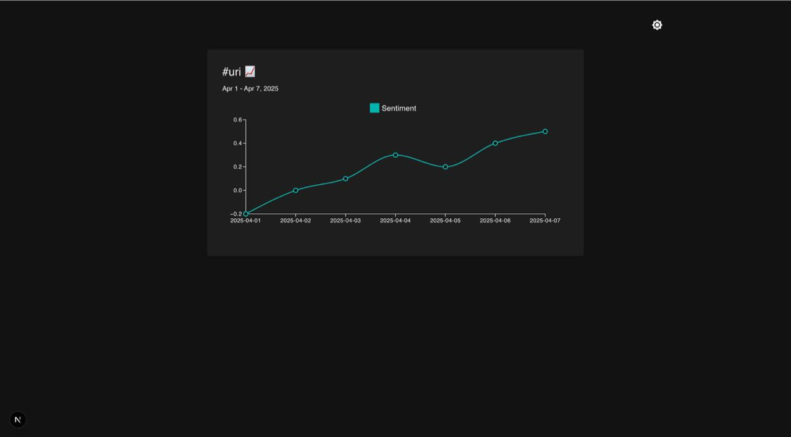
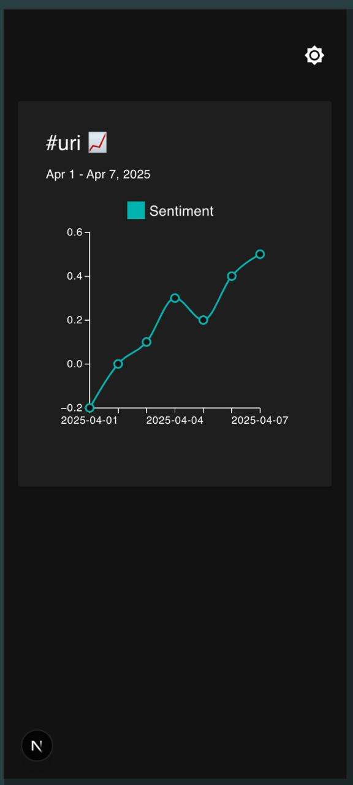

# 📊 Hashtag Sentiment Insight

An interactive insight page to visualize sentiment trends of a hashtag over time, using a dynamic route in Next.js, MUI for design, React Query for data fetching, and @mui/x-charts for visualizations.

---

## 🧠 Overview

This project demonstrates how to:

- Dynamically route to pages like `/insights/[hashtag]`
- Fetch mocked API data from `/api/trends/[hashtag]`
- Visualize sentiment trends using `<LineChart />` from `@mui/x-charts`
- Handle loading and error states gracefully
- Support dark/light mode toggling
- Lazily load heavy components with `next/dynamic`
- Use React optimizations like `useMemo`, `useCallback`, and `React.memo`
- Build with responsive and accessible Material UI components

---

## 🖼️ Screenshots

| Desktop | Mobile |
|--------|--------|
|  |  |

---

## ⚙️ Features

- ✅ Dynamic route for any hashtag `/insights/[hashtag]`
- ✅ Trend data line chart (📈 / 📉) with interactive hover
- ✅ Local mock API using `/pages/api/trends/[hashtag].ts`
- ✅ Dark mode toggle with persisted preference
- ✅ Lazy-loaded chart for better performance
- ✅ Mobile responsive layout
- ✅ Error handling with retry button

---

## 🚀 Tech Stack

- Next.js 13+
- TypeScript
- Material UI (`@mui/material`, `@mui/icons-material`)
- @mui/x-charts
- React Query
- CSS Modules or inline MUI styling
- Axios
- Mock API with file-based routing

---

## ⏱ Time Spent

| Task | Time |
|------|------|
| Initial setup & folder structure | 20 mins |
| API mocking + data fetching | 30 mins |
| Chart integration + lazy loading | 45 mins |
| Styling + responsive design | 30 mins |
| Dark mode toggle | 15 mins |
| Testing & debugging | 30 mins |
| README & cleanup | 15 mins |
| **Total** | **~3 hrs 5 mins** |

---

## 📦 Getting Started

```bash
# Clone the repo
git clone https://github.com/ezeugwadavid/hashtag-sentiment-insight.git
cd hashtag-sentiment-insight

# Install dependencies
npm install

# Run the app
npm run dev

